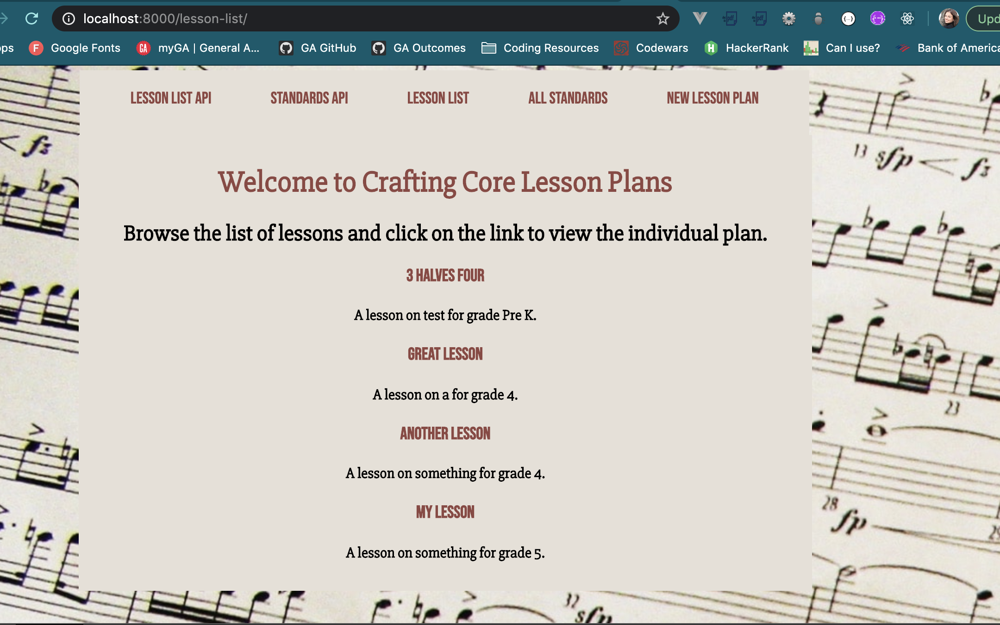
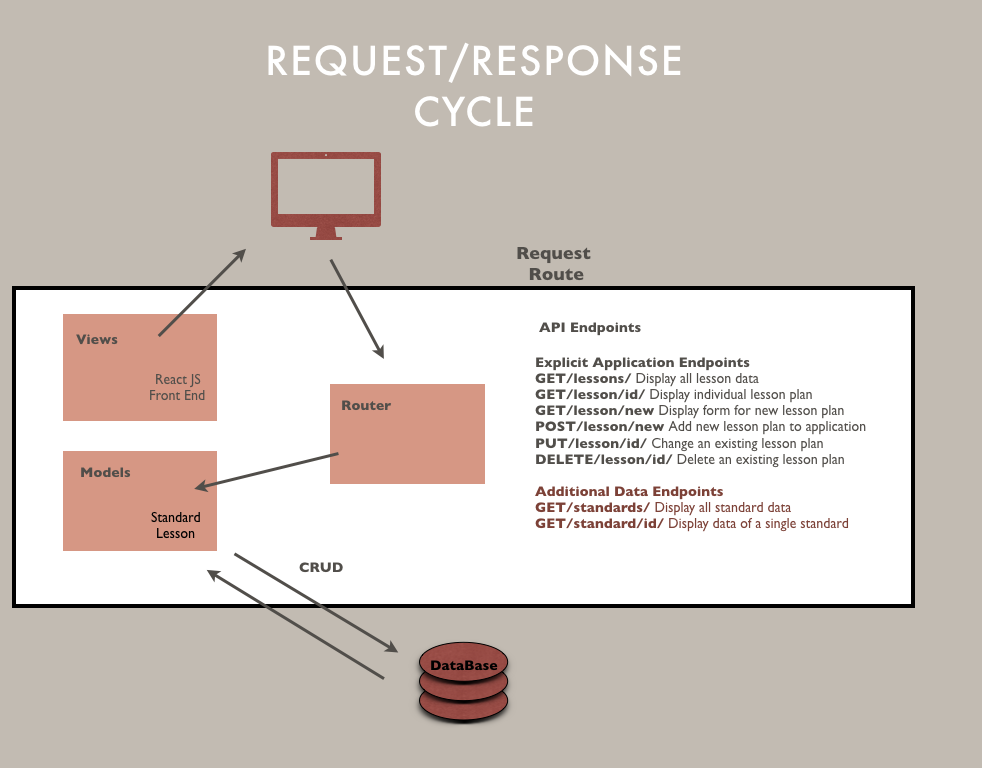
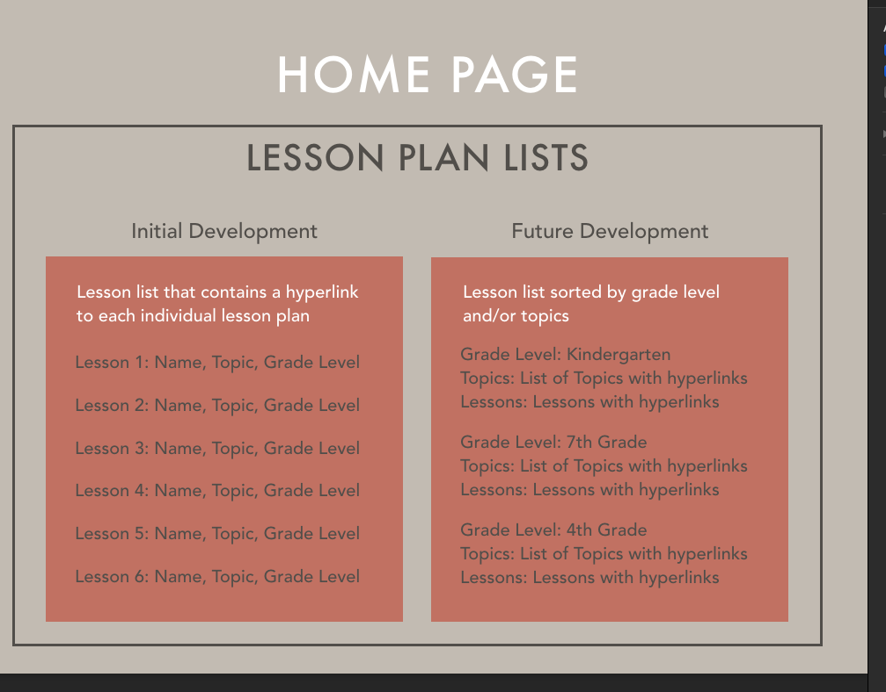
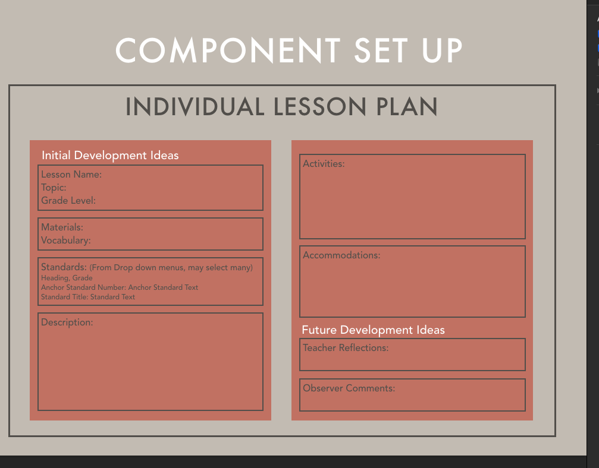
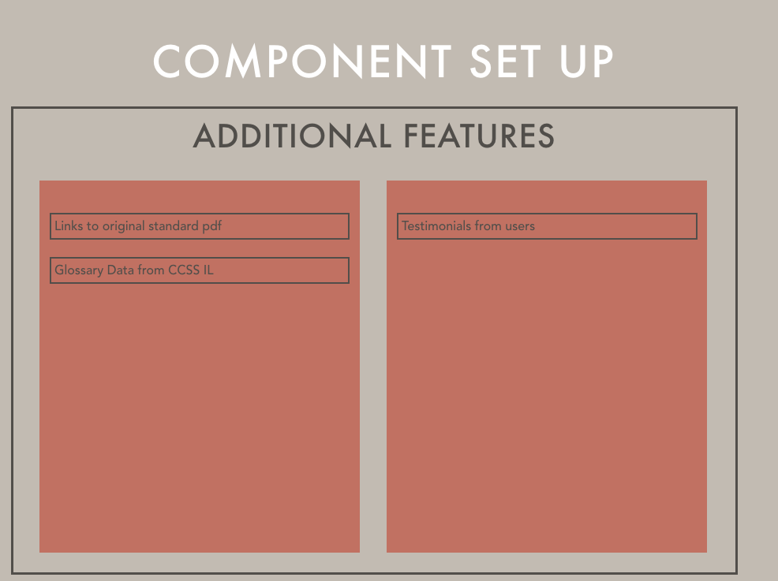

# Crafting Core Lessons (the front end)

## A React interface for a smooth user experience:

 

This application is linked to a custom built API that includes all 183 Illinois CCSS for Music. 
Visit [craftingCoreLessons-BE](https://github.com/spianoDev/craftingCoreLessons-BE) to see the full repo

## The backend use of the Response/Request Cycle

